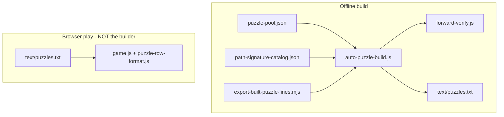

# Agent handoff: unique play path validation on shipped `starting_grid`

## Your mission

Update **word placement / export validation** so that when a player loads a puzzle from `text/puzzles.txt`, each `perfect_hunt` word has **exactly one** legal play path on the board they actually see — the shipped **`starting_grid`** (with shifts applied per hunt index in shift mode) — matching the pre-planned route for that word.

**Observed bug (playthrough):** Exported puzzles pass build + forward verify, but during real play there are **multiple valid drag paths** for a hunt word. Common cause: **overlay placement** routes through cells that already show the right letters from earlier words (or dense letter reuse), and **leftover** tiles nearby also show the same letter, so the player can spell the word via an unintended king path.

**Success criteria:** For every hunt index `i`, on the replay board at word `i` (after `perfect_hunt_shifts_before[i]` if present), ambiguity counting must yield **exactly one equivalence class** of paths under the rule below, and that class must contain the authored path for word `i`.

---

## Uniqueness rule (product decision)

**Do not require strict geometric uniqueness only.**

Treat two paths as **equivalent** when they produce the **same FIFO refill / play sequence** — i.e. the same sequence of `getTileText` values the player would append when visiting first-visit cells in path order (same rule as live refill parity).

**Implementation:** Use **`uniqueSpellingMode: 'fifo_equivalence'`** when counting paths on the **full labeled shipped grid** (not `'geometry'`, which counts distinct king strokes separately).

Concretely:

1. Build the player-visible board for hunt `i` (see below).
2. Run `countGamemakerWordPathsOnBoard(word, board, { uniqueSpellingMode: 'fifo_equivalence', stopAfter: 2, ... })`.
3. Require count **`=== 1`** (one FIFO signature class, not one geometry).
4. Require the authored `pathFlat` for that word to be **legal** on that board and to belong to that single class (via `fifoFirstVisitSpellingSignature` in [`js/puzzle-export-sim/path-placement.js`](js/puzzle-export-sim/path-placement.js)).

**Still enforce** geometry-only constraints that affect play regardless of FIFO class:

- King adjacency, `min_tiles` / reuse rules, `pathFlatReuseMatchesGlyphPerFlat`
- `pathFlatConflictsPenultimateUndoStroke` (penultimate-tap undo / `⋯A,B,A⋯`)

**Do not** collapse paths that differ in FIFO signature — those are genuinely different player experiences (different refill consumption order).

---

## Repo & branch state

- **Repo:** `/Users/johnriley/word-hunter` (Word Hunter / wordhunter.io)
- **Branch:** `test`
- **Shipped data:** `text/puzzles.enc` (AES-GCM encrypted JSON Lines in the browser bundle). Local **`text/puzzles.txt`** is gitignored plaintext for export/regen — **147 rows** as of the current shipped set.
- **Pool / catalog:** `text/gamemaker/pregen/puzzle-pool.json`, `text/gamemaker/pregen/path-signature-catalog.json` (~4.6MB, required for fast builds)
- **Tests:** `npm test`. After export-semantics changes, regen per [`.cursor/rules/puzzles-regeneration.mdc`](../.cursor/rules/puzzles-regeneration.mdc).

---

## Architecture



### Core library: `js/puzzle-export-sim/`

| Module                                                                 | Role                                                                               |
| ---------------------------------------------------------------------- | ---------------------------------------------------------------------------------- |
| [`auto-puzzle-build.js`](../js/puzzle-export-sim/auto-puzzle-build.js) | Main builder: list-order placement, inter-word shifts, exhaustive16 torus, export  |
| [`path-placement.js`](../js/puzzle-export-sim/path-placement.js)       | Legality, `fifoFirstVisitSpellingSignature`, `buildBoardForUniquenessFromSnapshot` |
| [`path-search.js`](../js/puzzle-export-sim/path-search.js)             | `findRandomLegalPathFlat`, `countGamemakerWordPathsOnBoard`                        |
| [`word-path-search.js`](../js/puzzle-export-sim/word-path-search.js)   | Barrel re-export                                                                   |
| [`forward-verify.js`](../js/puzzle-export-sim/forward-verify.js)       | Forward replay: FIFO, shifts                                                       |
| [`shift-starter.js`](../js/puzzle-export-sim/shift-starter.js)         | Shift replay, `pathSpellsWordOnBoard`                                              |
| [`build-board-utils.js`](../js/puzzle-export-sim/build-board-utils.js) | `allPlacedHuntPathsVisibleOnBoard`                                                 |
| [`path-catalog/`](../js/puzzle-export-sim/path-catalog/)               | Precomputed path variants                                                          |

### Export helpers: `js/puzzle-build/`

| Module                                                                  | Role                                                                   |
| ----------------------------------------------------------------------- | ---------------------------------------------------------------------- |
| [`build-export-payload.js`](../js/puzzle-build/build-export-payload.js) | `starting_grid`, `next_letters`, `perfect_hunt`, starter tor neighbors |
| [`pool-order.js`](../js/puzzle-build/pool-order.js)                     | Hunt list + sack refill ordering                                       |
| [`swap-buckets.js`](../js/puzzle-build/swap-buckets.js)                 | Same-stats word alternates on build failure                            |
| [`problematic-words.js`](../js/puzzle-build/problematic-words.js)       | Authoring blocklist                                                    |

### CLIs

- [`scripts/export-built-puzzle-lines.mjs`](../scripts/export-built-puzzle-lines.mjs) — bulk export
- [`scripts/regenerate-puzzles-txt.mjs`](../scripts/regenerate-puzzles-txt.mjs) — regen from `perfect_hunt`
- [`scripts/lib/puzzle-build-cli.mjs`](../scripts/lib/puzzle-build-cli.mjs) — shared build flags

Example export flags used for the current 100 puzzles:

```bash
--shift --shift-exhaustive16 --verify --lookahead --tiered --seed-skew 200 --attempts-build 280
```

---

## Shift-mode export semantics (preserve)

- **`starting_grid`** = final generation board (all hunt letters visible at once).
- **`next_letters`** = FIFO sack from build-time `covered` (desc placement); internal `""` peel slots preserved.
- **`perfect_hunt`** = ascending hunt order.
- **`perfect_hunt_shifts_before[i]`** = ops before hunt word `i` (empty for index 0).
- **Play:** Shifts are **manual** in the UI; metadata is not auto-applied.

---

## Why puzzles are valid but ambiguous today

1. **Overlay placement** — snapshot letters do not gate DFS; paths may cross pre-filled matching cells.
2. **Uniqueness at build time** often uses the **pre-commit snapshot** and/or **`geometry`** mode, not FIFO-equivalence on the **full shipped grid**.
3. **`requireCoexistentPathsOnFinalGrid`** only checks that each path **spells** on the board, not unique FIFO class.
4. **Forward verify** does not assert one FIFO class per hunt word on the player-visible board.

**Failure mode:** On the full `starting_grid`, multiple king paths spell the word but should be rejected unless they share one FIFO signature — today multiple signatures may exist.

---

## Validation board per hunt word

For hunt index `i`:

1. `board = clone(starting_grid)`
2. `board = applyShiftSeqToBoard(board, perfect_hunt_shifts_before[i] ?? [])`
3. Use **all cell letters as-is** on that board (full labeled grid — do not overlay-stamp only along the path for counting).
4. `countGamemakerWordPathsOnBoard(perfect_hunt[i], board, { uniqueSpellingMode: 'fifo_equivalence', stopAfter: 2, exploreBudget })`
5. Assert count `=== 1`
6. Assert authored path’s FIFO signature matches the sole class and `pathSpellsWordOnBoard(board, word, pathFlat)`

Helper reference:

```javascript
import { countGamemakerWordPathsOnBoard } from "../js/puzzle-export-sim/path-search.js";
import { fifoFirstVisitSpellingSignature } from "../js/puzzle-export-sim/path-placement.js";
import { wordToTileLabelSequence } from "../js/board-logic.js";
import { applyShiftSeqToBoard } from "../js/puzzle-export-sim/shift-starter.js";
```

---

## Recommended implementation steps

1. **Add a shared helper** e.g. `assertUniqueFifoPathOnShippedGrid(row, pathsAsc, shiftsBefore)` in `forward-verify.js` or a small `play-path-uniqueness.js` module.
2. **Call from `forward-verify`** (and/or export gate in `auto-puzzle-build.js`) so bad rows fail verify/build.
3. **Placement-time gate (optional tightening):** after all words placed, run the same check on final `starting_grid` before accepting a whole build.
4. **Tests:** Load lines from `text/puzzles.txt`; for a known-ambiguous case (once reproduced), assert failure; for a fixed row, assert pass. Extend [`tests/shift-export-row.test.js`](../tests/shift-export-row.test.js).
5. **Regenerate** `text/puzzles.txt` after rules tighten (`export-built-puzzle-lines.mjs` or regen script); expect more build failures / higher `--seed-skew`.

---

## What NOT to break

- Do not import `auto-puzzle-build` or path catalog into the browser client (`game.js` only needs `next-letters`, `puzzle-row-format`, `shift-starter` helpers).
- Preserve FIFO peel `""` slots in `next_letters`.
- Preserve manual shifts in play (no auto-apply of `perfect_hunt_shifts_before`).
- Keep penultimate-undo legality in all path checks.

---

## Useful commands

```bash
npm test
npm test -- tests/word-path-search.test.js

node scripts/export-built-puzzle-lines.mjs --from 0 --to 0 --out /tmp/one.jsonl \
  --shift --shift-exhaustive16 --verify --lookahead --tiered --verbose
```

---

## Prior session context

- Shift export: `starting_grid` = final board, build-time `covered` → `next_letters`, forward verify with shifts.
- Removed auto-apply of shifts in play.
- Refactored `path-placement` / `path-search`, path catalog subfolder, shared CLI libs.
- Generated 100 shift puzzles (pool rows 0–99) in `text/puzzles.txt`.

---

## Start here

1. Reproduce multiple **FIFO-distinct** legal paths for one hunt word on one line of `text/puzzles.txt`.
2. Implement shipped-grid check with **`fifo_equivalence`** count `=== 1` plus authored-path membership.
3. Wire into verify + builder; add tests; re-export puzzles when green.
